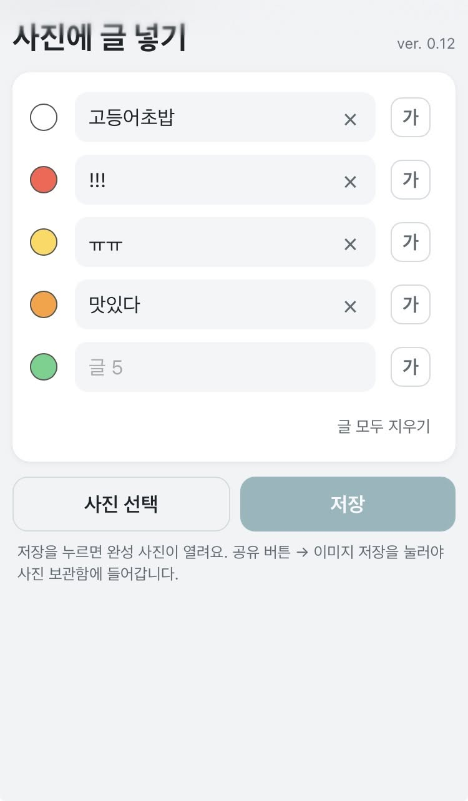
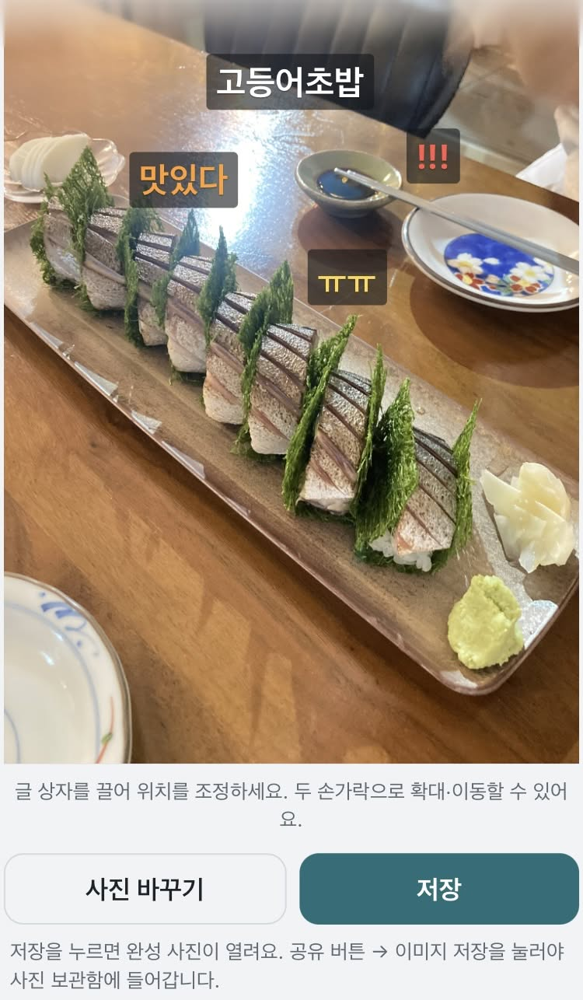

# 사진에 글 넣기

사진 위에 여러 줄의 글을 직접 배치하고, 완성된 이미지를 사진 보관함에 저장할 수 있는 간단한 웹앱입니다.

앱스토어에서 별도 앱을 설치하거나 회원 가입할 필요 없이, iPhone Safari에서 열어 **홈 화면에 추가**하면 일반 앱처럼 사용할 수 있습니다. 한 번 추가하면 인터넷 연결이 없는 상황에서도 작업할 수 있습니다.

[사진에 글 넣기 실행하기](https://unnitti.github.io/photo_text_pwa/)

## 이런 분께 제안합니다

- 전/후 비교 사진에 짧은 설명을 넣고 싶은 분
- 현장 사진에 작업 단계나 간단한 메모를 표시하고 싶은 분
- 복잡한 편집 앱 대신 글만 빠르게 얹고 싶은 분
- 사진을 외부 서버에 올리지 않고 내 휴대폰 안에서 처리하고 싶은 분

## 주요 기능

- 사진 보관함에서 사진 선택
- 최대 8줄까지 글 입력 (마지막 줄에 쓰면 빈 줄이 자동으로 생겨요)
- 문장마다 글자 크기와 색상을 개별 지정
- 사진 위에서 글 상자를 이동·확대해 원하는 위치에 배치
- 원본 크기의 JPG로 저장
- EXIF 위치·촬영 정보 제거
- 완성 이미지를 열어 공유 → 이미지 저장으로 사진 보관함에 저장
- 홈 화면 추가 및 오프라인 사용 지원

  
  

## 사용 방법

1. 글을 먼저 입력합니다. 마지막 줄에 글을 쓰면 빈 줄이 하나 더 생기고, 최대 8줄까지 쓸 수 있어요. 비워 둔 줄은 사진에 표시되지 않습니다.
2. 각 줄의 색(왼쪽 동그라미)과 크기(오른쪽 **가**)는 누를 때마다 다음 값으로 바뀝니다. 새로 글을 쓰는 줄에는 아직 쓰지 않은 색이 자동으로 정해져요.
3. 아래의 **사진 선택**을 눌러 사진 보관함에서 사진을 불러오거나 새로 촬영합니다.
4. 사진 위의 글 상자를 손가락으로 끌어 원하는 위치에 배치합니다. 두 손가락으로 확대·이동하면 작은 글씨도 정밀하게 배치할 수 있고, 끝까지 줄이면 사진 전체에 맞게 돌아옵니다.
5. **저장**을 누른 뒤, 열린 완성 이미지 화면에서 iPhone의 공유 버튼을 눌러 **이미지 저장**을 선택합니다.

## 알아두면 좋은 기능

- 6자리 숫자 자동 변환: 260923처럼 6자리 숫자를 입력하면 `26.09.23`처럼 날짜 형식으로 자동 변환됩니다.
- **줄 지우기(×)**: 글이 있는 줄 오른쪽의 ×를 누르면 그 줄의 글, 크기, 색이 처음 상태로 돌아갑니다.
- **글 모두 지우기**: 사진은 그대로 두고 입력한 글을 모두 지웁니다.
- **되돌리기**: 줄 지우기나 글 모두 지우기 직후 몇 초 동안 화면 아래에 나타납니다. 사진은 되돌림 대상이 아닙니다.
- **사진 바꾸기**: 글과 글 상자 위치는 그대로 두고 사진만 바꿉니다.
- 같은 색 표시: 글이 있는 두 줄의 색이 같으면 색 동그라미에 겹침 표시가 나타납니다.

## 개인정보

선택한 사진과 입력한 문장은 외부 서버로 전송되지 않습니다. 모든 편집은 사용자의 브라우저 안에서 이루어집니다.

## 오프라인 사용

처음 실행할 때는 인터넷에 연결된 상태에서 앱을 열고 홈 화면에 바로가기를 추가해 주세요.

이후에는 저장된 파일로 바로 열리고, 인터넷에 연결되어 있으면 앱을 열 때마다 새 버전을 백그라운드로 받아 둡니다. 새 버전은 다음에 앱을 열 때부터 적용될 수 있어요. 인터넷이 없어도 그대로 동작합니다.

다만 iPhone의 웹사이트 데이터가 삭제되거나 저장 공간이 부족해 캐시가 지워진 경우에는 인터넷에 연결해 다시 한 번 앱을 열어줘야 합니다.

## 직접 설치하기

이 저장소의 파일을 웹 서버 또는 GitHub Pages에 올린 뒤, iPhone Safari에서 해당 주소를 열어 **공유 → 홈 화면에 추가**를 선택하면 됩니다.

## 참고

이 프로젝트는 OpenAI Codex와 Claude의 도움을 받아 제작했습니다.

Android 스마트폰에서도 Chrome 브라우저를 통해 동작할 것으로 예상되지만, 별도 기기 테스트는 아직 진행하지 않았습니다.
